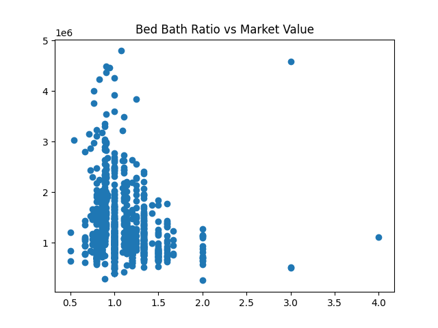

# Property Analysis
Let's take a look at how the tax parcel values trends look.  There are some very general trends that we know will hold. Let's start with the general property values We can see from the histogram most home values are around $860,000.  The Median price is about $1.1M and the Average price is $1.28M.  Remember this a beach town so the homes prices will typically be higher.  The price distribution is not exactly a normal curve, with the higher end homes driving the median/mean prices up and away from the histogram max.

The median square footage for a home is 2350 sqft, while the average square footage is 2446 sqft.  Not a large difference.  Meanwhile, the median number of bedrooms is 4 and the average number of bedrooms is 3.6.  This tells us that on average the more expensive homes have square footage per bedroom, but not necessarily more bedrooms.
The square footage of a house will naturally drive the price right?

We see that there is a large cluster of homes below 3000 sqft.  The larger homes (>3000sqft) dominate the top half of the market value though.

Let's see how the price changes with the number of bedrooms.

There is a large variance within each bin of bedrooms, but in general, the more bedrooms, the higher the price (duh). How about bathrooms? Does that play a factor?

This plot tells us that as the number of bedrooms increases, the number of bathrooms does too.  Great everybody's gotta go! This is a pretty linear trend, let's see how this ratio affects the price...
 

Given this plot we can tell that a higher ratio of beds to baths gives more value to a home than more baths to beds.  However, most homes tend to favor a 1:1.  I should be clear that this bathroom value also includes half baths.  We have some outliers in the 3+ bed:bath range, but that doesn't necessarily drive up the price.

We have a few more things we can check for obvious value.  Sometimes there are historic and those go for high dollar values!

hmm it seems that there's only 1 home built before the 70s and indeed it is pricy.  The other things we can notice from this plot are some waves of housing builds.  This will be easier to see as a histogram.

Using the histogram we can see some distinct housing booms on Bald Head Island, (1983, 1988, 1994, 1999, 2005, and 2021). It would be interesting to line these up with the general health of the economy.  We know there was a recession in the 80s, between 1980 and 1983.  So we find a housing boom after the recession.  Likewise we can see a huge housing bubble at 2005 and we all know what happened there.  Looking at 2006-2011, the housing builds crashed!  Finally we know that around 2020-2021, credit became very cheap due to the low interest rates set by the federal reserve, therefore housing builds increase.
The final plot I want to explore is where the parcel value really is...is it the building or is it the land?

We see two scatter plots here.  The total value is plotted against the building value and against the land value.  While they both are fairly linear (as you increase the value in one the total goes up), the dominating value is the land value!  We can build more buildings, but it's pretty tough to build more land, especially on an island.

So let's make a market recommendation from all of this.  If you see a home on Bald Head Island with 4 bedrooms, 3-4 bathrooms, and it's listed below $1.1M (preferably around $860K) you're getting a fair deal.